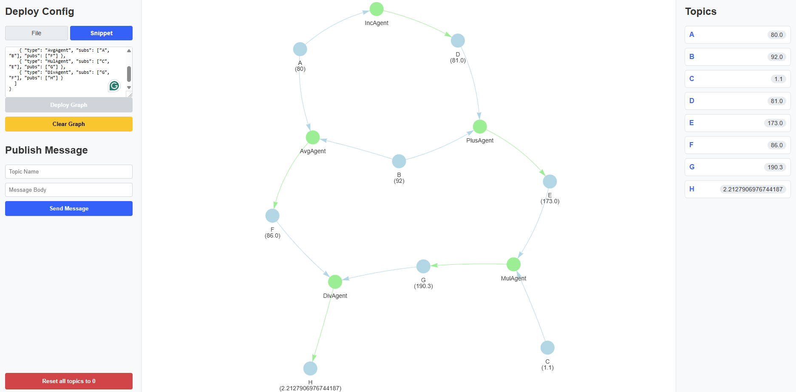

## Pub-Sub Project

This project was done during the course **"Advanced Programming"** with
Prof. Eliahu Khalastchi, Bar-Ilan University, 2026, second semester.

It implements a full server with a backend implementing a computational
graph, an HTTP API, and a web frontend.

The backend implements a **publisher-subscriber** mechanism: publishers
can publish messages to specific topics, and subscribers can subscribe
to these topics to automatically get new published messages. The agents
that perform the computations form a directed graph that the user can
visualize and interact with in the browser.



---

## Features

- A minimal **HTTP server** written from scratch using `java.net.Socket`,
  with a small servlet API and a fixed-size worker thread pool.
- A **publisher-subscriber** core: topics, messages, agents, and a
  thread-safe `TopicManager` singleton.
- **Computational agents** that subscribe to topics, perform a
  computation, and publish the result. The following implementations
  are provided:
    - `PlusAgent` — sum of N input topics (`subs[0] + subs[1] + ... + subs[N-1]`)
    - `MulAgent` — product of N input topics (`subs[0] * subs[1] * ... * subs[N-1]`)
    - `AvgAgent` — average of N input topics (`(subs[0] + ... + subs[N-1]) / N`)
    - `DivAgent` — divides two numbers (`subs[0] / subs[1]`, with
      division-by-zero protection)
    - `IncAgent` — increments a single number by 1
    - `BinOpAgent` — generic binary operation, programmatic use only

  `PlusAgent`, `MulAgent` and `AvgAgent` accept any number of inputs.
  They wait until they have received at least one value on every input
  before publishing for the first time.
- A **generic configuration loader** that builds the agent graph from a
  JSON file, using Java reflection.
- A **graph view**: every topic / agent is shown as a node, with the
  latest message displayed under the node name.

---

## Requirements

- Java 17 or higher
- Maven (for dependency management; only `jackson-databind` is used)
- Node.js and npm (to build the React frontend)
- A web browser (Chrome recommended)
- An internet connection (the Vis.js library used by the frontend is
  loaded from an external server)

---

## How to Run

### 1. Build the Web UI

Before starting the Java server, you must compile the React frontend:

1. Open a terminal and navigate to the `web` directory.
2. Run `npm install` to install the frontend dependencies.
3. Run `npm run build` to compile the app. This generates the `dist` folder inside `web` that the Java server uses.

### 2. Run the Java Server (IntelliJ IDEA)

1. Open the project in IntelliJ.
2. Let Maven download the dependencies (`jackson-databind`).
3. Run `Main.java`.
4. Open a browser at <http://localhost:8080/app>.
5. Press **Enter** in the terminal where the server is running to stop it.

### 3. Run the Java Server (Visual Studio Code)

1. Open the project folder in VS Code (ensure you have the **Extension Pack for Java** installed).
2. Let the Java extension sync the project and download Maven dependencies (`jackson-databind`).
3. Open `src/main/java/Main.java` and click the **Run** button (code lens) above the `main` method, or press `F5`.
4. Open a browser at <http://localhost:8080/app>.
5. Press **Enter** in the terminal where the server is running to stop it.

---

## How to Use the Web UI

The main page is split into three columns:

- **Left** — Upload a JSON configuration and publish messages to topics.
- **Center** — Live view of the computational graph.
- **Right** — List of every topic with its latest value.

### 1. Deploy a configuration

You can deploy a graph configuration using two different modes:
- **File Mode:** Drop a `.json` file into the **"Drop your `.json` config here"** zone (or click to select one).
- **Snippet Mode:** Switch to the **Snippet** tab and paste or type your raw JSON configuration directly into the text area.

Once a file is selected or a snippet is entered, press the green **Deploy Graph** button to update the graph. The button will be disabled if the current configuration is already deployed.

You can also use the yellow **Clear Graph** button to completely remove all nodes and start with a blank canvas.

### 2. Publish a message

Fill in the **Topic** and **Message** inputs and press **Send**.
The new value will appear in the topics sidebar, and the graph view
will refresh.

### 3. Reset everything

Press the red **"Reset all topics to 0"** button. The server will:

- call `reset()` on every agent (clearing their internal state), and
- publish the message `"0"` on every topic.

After the reset, every topic shows `0.0` and the graph view is refreshed.

---

## Configuration JSON Format

A configuration describes a list of agents to instantiate. Each agent
has:

- `type` — name of the agent class (must be a class in the `graph`
  package that has a constructor `(String[] subs, String[] pubs)`).
- `subs` — list of topic names this agent **subscribes to**.
- `pubs` — list of topic names this agent **publishes to**.

### Example

```json
{
  "agents": [
    { "type": "PlusAgent", "subs": ["A", "B"], "pubs": ["C"] },
    { "type": "IncAgent",  "subs": ["C"],      "pubs": ["D"] }
  ]
}
```

This creates the following graph:

```
   A ─┐
      ├──► PlusAgent ──► C ──► IncAgent ──► D
   B ─┘
```


### Rules

- Topic names can be any string. They are created automatically the
  first time they are referenced.
- An agent only computes / publishes once it has received at least one
  value on each of its input topics.
- The graph must **not contain a cycle** — the server rejects cyclic
  configurations.
- For `PlusAgent` / `MulAgent` / `AvgAgent`, if the same topic name
  appears more than once in `subs`, it counts multiple times (e.g.
  `subs: ["A", "A", "B"]` with a `PlusAgent` computes `A + A + B`).

---

## HTTP API

The HTTP server exposes a small REST-like API. You can use it from your
own scripts, from `curl`, or from any HTTP client.

### `GET /graph`

Returns the current graph as JSON.

**Example**

```bash
curl http://localhost:8080/graph
```

**Response**

```json
{
  "nodes": [
    { "id": 1, "label": "TA\n(3.0)",  "color": "lightblue" },
    { "id": 2, "label": "APlusAgent", "color": "lightgreen" }
  ],
  "edges": [
    { "from": 1, "to": 2 }
  ]
}
```

Node labels starting with `T` represent topics, those starting with
`A` represent agents.

### `POST /upload`

Uploads a new JSON configuration and replaces the current one.
The body must be `application/x-www-form-urlencoded` with a single
`config` field containing the URL-encoded JSON.

**Example** (sending the contents of `config.json`)

```bash
curl -X POST http://localhost:8080/upload \
     --data-urlencode "config@config.json"
```

The response is the JSON of the new graph (same shape as `GET /graph`).

### `GET /publish`

Publishes a message on a topic.

**Query parameters**

| Name      | Required | Description                          |
|-----------|----------|--------------------------------------|
| `topic`   | yes      | Name of the topic                    |
| `message` | yes      | Message body (text or number)        |

**Example**

```bash
curl "http://localhost:8080/publish?topic=A&message=3"
curl "http://localhost:8080/publish?topic=B&message=4"
```

**Response** — A JSON snapshot of every topic and its latest value:

```json
{
  "topics": [
    { "name": "A", "value": "3.0" },
    { "name": "B", "value": "4.0" },
    { "name": "C", "value": "7.0" }
  ]
}
```

### `POST /reset`

Resets every agent's internal state and publishes `"0"` on every topic.
Takes no body. Returns the same JSON snapshot as `/publish`.

**Example**

```bash
curl -X POST http://localhost:8080/reset
```

**Response**

```json
{
  "topics": [
    { "name": "A", "value": "0.0" },
    { "name": "B", "value": "0.0" },
    { "name": "C", "value": "0.0" }
  ]
}
```

### `GET /app`

Serves the static front-end (HTML / CSS / JS). Open it in a browser
at <http://localhost:8080/app>.

---

## End-to-End Example

1. Save the following file as `sum_then_inc.json`:

   ```json
   {
     "agents": [
       { "type": "PlusAgent", "subs": ["A", "B"], "pubs": ["C"] },
       { "type": "IncAgent",  "subs": ["C"],      "pubs": ["D"] }
     ]
   }
   ```

2. Start the server (`Main.java`) and open <http://localhost:8080/app>.

3. Drop `sum_then_inc.json` into the upload zone and click **Deploy**.

4. Publish two values:
    - Topic `A`, message `3`
    - Topic `B`, message `4`

5. The topics sidebar will now show:

   ```
   A = 3.0
   B = 4.0
   C = 7.0
   D = 8.0
   ```

---

## Internal Representation of HTTP Entities

To support robust error handling and ensure predictable API outputs, the web server uses Data Transfer Objects (DTOs) for its data lifecycle:

1. **`server.dto.HTTPRequest`**: The `RequestParser` parses the raw `Socket` InputStream into this strongly-typed object, encapsulating the URL, segments, parameters, and payloads.
2. **`server.dto.HTTPResponse`**: Servlets do not interact with `OutputStream`s directly. Instead, they process an `HTTPRequest` and return an `HTTPResponse` DTO containing the status code, headers, and body.
3. **`server.exceptions.HTTPException`**: Servlets throw this exception to gracefully bubble up status codes (like `404` or `400`). The core `MyHTTPServer` intercepts these exceptions and guarantees a properly formatted `application/json` error response is safely written back to the client.

---

## Project Layout

```
src/main/java/
├── Main.java                  # Entry point of the application
├── graph/                     # Pub-sub core: topics, agents, messages
│   ├── Agent.java
│   ├── AvgAgent.java          # average of N input topics
│   ├── BinOpAgent.java
│   ├── Config.java
│   ├── DivAgent.java          # subs[0] / subs[1]
│   ├── GenericConfig.java     # Loads agents from a JSON file
│   ├── Graph.java             # Builds a visual graph from the topics
│   ├── IncAgent.java
│   ├── Message.java
│   ├── MulAgent.java          # product of N input topics
│   ├── Node.java
│   ├── ParallelAgent.java     # Runs an agent on its own thread
│   ├── PlusAgent.java         # sum of N input topics
│   ├── Topic.java
│   └── TopicManagerSingleton.java
├── server/                    # The HTTP server
│   ├── HTTPServer.java
│   ├── MyHTTPServer.java
│   ├── RequestParser.java
│   ├── dto/
│   │   ├── HTTPRequest.java   # Internal request state DTO
│   │   └── HTTPResponse.java  # Internal response generation DTO
│   └── exceptions/
│       └── HTTPException.java # Safely bubbled HTTP error codes
├── servlets/                  # One servlet per endpoint
│   ├── BaseServlet.java
│   ├── ConfLoader.java        # POST /upload
│   ├── GraphDisplayer.java    # GET  /graph
│   ├── HtmlLoader.java        # GET  /app
│   ├── ResetServlet.java      # POST /reset
│   ├── Servlet.java
│   └── TopicDisplayer.java    # GET  /publish
└── view/
    └── HtmlGraphWriter.java   # Graph -> JSON for the frontend

web/                           # Modern React frontend
├── App.jsx                    # Main React component & UI logic
├── main.jsx                   # React entry point
├── index.html                 # Vite HTML template
├── package.json               # Node dependencies and build scripts
├── vite.config.js             # Vite bundler configuration
└── dist/                      # Compiled frontend (generated after npm run build)
```

---

## Writing Your Own Agent

To add a new agent:

1. Create a new class in the `graph` package that implements `Agent`.
2. Provide a public constructor with the exact signature
   `public MyAgent(String[] subs, String[] pubs)`.
3. In the constructor, subscribe to the topics you need and register as
   publisher of the output topic(s).
4. Implement `callback(String topic, Message msg)` with your logic.
5. Reference your new class from the JSON config with
   `"type": "MyAgent"` — `GenericConfig` will pick it up automatically.
